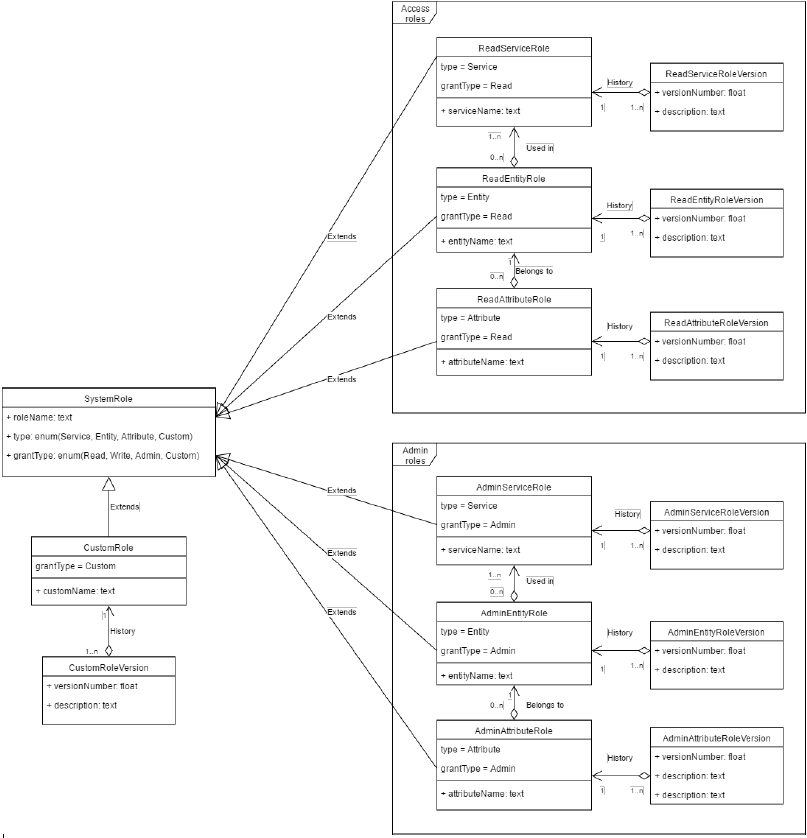
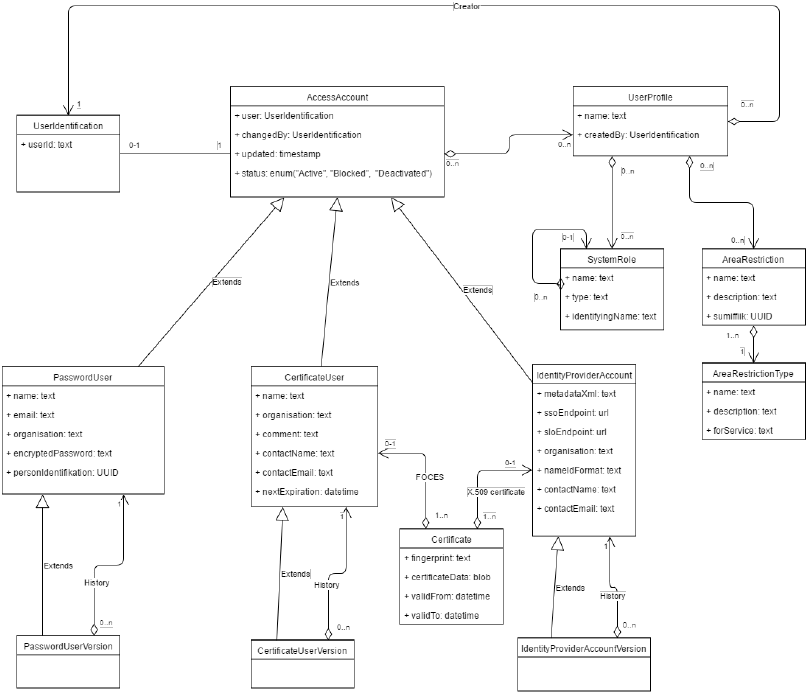

Adgangsrettigheder
==================

Dette afsnit beskriver hvorledes rettigheder i form af brugerprofiler er opbygget, og hvordan administreringen af dem
relaterer sig til rettighedsstyring i datafordeleren.

Systemroller
------------

Systemroller defineres automatisk af datafordelerens plugins, der skaber forbindelsen til de individuelle registre.
De bruges til at give datafordelerens anvendere begrænset adgang til datafordelerens services.

I implementeringen af hver enkelt service angives hvilke systemroller den har brug for i forbindelse med kontrol af
rettigheder og logikken for hvordan systemrollerne bruges til at verificere adgangen.

I DAFO Admin kan datafordelerens administratorer og serviceudbydere tildele systemroller til datafordelerens
anvendere.

Systemroller defineres på tre niveauer:

* Serviceniveau - Bruges til at give adgang til en hel service, f.eks. CVR-data
* Entitetsniveau – Bruges til at give adgang til enkelte dataentiteter inden for et givent register,
f.eks.ejerregistreret i CVR.
* Attributniveau – Bruges til at give adgang til enkelte attributter på entiteter,
f.eks. objekter tilknyttet et bestemt CPR-nummer.

Derudover er der tilpassede systemroller, der bruges til at implementere rettigheder der ikke kan dækkes af ovenstående.
Disse roller gives betegnelse ”Custom” i systemet. Custom-roller bruges for eksempel til at definere om en bruger i
systemet er administrator eller serviceudbyder.

For hver rolletype er der defineret både read-roller og admin-roller. Read-roller bruges til at give adgang til data og
services. Admin-roller bruges til at give administratorer og serviceudbydere mulighed for at tildele read-roller til
anvendere.
Der er to Admin-roller; DAFO Administrator og DAFO Serviceudbyder.
DAFO Administrator giver adgang til DAFO Admin uden nogen begrænsninger.
DAFO Serviceudbyder giver adgang til DAFO Admin, men der kan kun tildeles systemroller, områdeafgrænsninger og
brugerprofiler, som serviceudbyderen selv har adgang til. DAFO Serviceudbyder bruges til at give eksterne personer
mulighed for at give adgang til et givent register.

Illustrationen herunder viser model for systemroller i datafordeleren og hvordan systemroller defineres under
udvikling af et plugin til datafordeleren.

Områdeafgrænsning
-----------------

Områdeafgrænsning giver en service i datafordeleren mulighed for at definere en række områder, som adgangen til en
service kan opdeles i. Det er op til implementeringen af servicen at definere hvad områderne er, hvad de hedder,
hvad de dækker og hvordan de teknisk bruges til at afgrænse forespørgsler til servicen.

Områdeafgrænsninger har kun effekt inden for den service, som den er defineret af. En områdeafgrænsning for CVR har
altså ingen effekt for CPR.

I DAFO Admin kan datafordelerens administratorer og serviceudbydere tildele områdeafgrænsninger til datafordelerens
anvendere. Det vil begrænse anvendere der tildeles brugerprofilen til data fra de valgte områder.

Er der ikke valgt nogen områdeafgrænsninger for en service, så er det det samme som at have valgt alle
områdeafgrænsninger for den service. Brugerprofilen giver dermed adgang til alting inden for servicen.

Brugerprofiler
--------------

Rettigheder i datafordeleren tildeles til anvendere via brugerprofiler. En brugerprofil dækker en række systemroller,
der giver adgang til deres respektive service/entitet/attribut og en eventuel liste af områdeafgrænsninger. På den måde
er brugerprofiler let håndterbare "pakker", der kan tildeles anvendere.

I DAFO Admin kan datafordelerens administratorer og serviceudbydere oprette brugerprofiler og tildele dem til
datafordelerens anvendere. Herved tildeles rettigheder til datafordeleren til dens anvendere.

Tildeling af rettigheder
------------------------

Tildeling af rettigheder til en given anvender, der logger ind via datafordelerens identity provider eller via
system-til-system certifikat vil typisk være en todelt process: Først oprettes en række brugerprofiler, der beskriver
de services, data og områder, anvenderen skal have adgang til. Efterfølgende tildeles disse brugerprofiler til
anvenderens brugeridentitet. Skal flere anvendere have de samme adgange, vil det være muligt at genbruge tidligere
oprettede brugerprofiler, og det første trin kan springes over.

Tildeling af rettigheder til brugere der kommer fra en ekstern identity provider, følger en anden model. Her skal den
eksterne identity provider først oprettes i datafordelerens administrationssystem. Derefter oprettes en række
brugerprofiler, der definerer rettigheder som den eksterne provider skal kunne uddele og disse tilknyttes den oprettede
provider. Denne liste af brugerprofiler vil fungere som en ”white-list” der bruges til at godkende brugerprofiler
angivet i en SAML token fra den eksterne provider, så de kan blive videreført til en datafordelertoken i forbindelse
med login til datafordeleren.

Det skal bemærkes at samme metode bruges til at tildele read- og admin-roller i administrationssystemet. Retten til
at oprette brugerprofiler, der indeholder admin-roller, vil blot være afgrænset til brugere med den specielle rolle,
der gør dem til administratorer.

Illustration herunder viser datamodel for bruger/profil/rolle system igennem administrationssystemet og oversættelse
af brugerprofiler til systemroller og områdeafgrænsninger.

