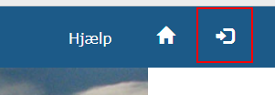

Login i DAFO Admin
==================

For at få adgang til funktionaliteten i DAFO Admin er det nødvendigt at logge
ind i systemet. Dette kan ske på to måder:

* Ved at angive brugernavn og adgangskode for en bruger registreret i systemet
  med passende rettigheder
* Ved at logge ind via en ekstern SAML Identity Provider for en organisation
  der er registreret i systemet med passende rettigheder

Med "passende rettigheder" forstås at den identificerede bruger/IdP gennem
brugerprofiler er blevet tildelt adgang til enten ``DAFO Administrator``
systemrollen eller ``DAFO Serviceudbyder`` systemrollen. Hvis du får en fejl
``403 Forbidden`` efter login skyldes det sandsynligvis at din bruger ikke er
konfigureret med en af disse roller.

Login via Brugernavn og Adgangskode
-----------------------------------

For at logge ind via brugernavn og adgangskode klikkes på "Log ind" ikonet i
øverste højre hjørne.

Hvis ikke fanebladet med "Brugernavn og kodeord" er
aktivt klikkes der på dette. Derefter udfyldes brugernavn og adganskode
felterne og der klikkes på "LOG IND".

Login via Organisation
----------------------

For at logge ind via organisation klikkes på "Log ind" ikonet i øverst højre
hjørne. Hvis fanebladet "Organisation login" ikke er aktivt klikkes på dette.
Derefter vælges den ønskede organisation i dropdown'en og der klikkes på
"LOG IND".

Systemet viderestiller herefter til **DAFO STS**, hvor der eventuelt skal
foretages et login i den eksterne IdP der er tilknyttet den valgte
organisation. Ved successfuldt login og udstedelse af token fra STS'en
returneres brugeren til DAFO Admin og logges ind.

Logout
------

For at logge ud af DAFO Admin klikkes på "Log ud" knappen i øverste højre
hjørne. Vær opmærksom på at dette kun logger ud af DAFO Admin og ikke ud fra
en eventuel ekstern IdP brugt ved login via organisation.

Genskabelse af mistet adgang
----------------------------

Hvis man bliver lukket ud af systemet enten på grund af en mistet adgangskode
eller fordi man mister tilknytningen til rollen ``DAFO Administrator`` er det
muligt at genskabe adgangen via Djangos indbyggede konsolværktøjer.

Der er oprettet følgende konsolkommandoer der aktiveres via manage.py scriptet
i roden af Django-projektet for løsningen:

* ``python manage.py createuser`` - Opretter en ny superbruger med
  ``DAFO Administrator`` rollen tilknyttet.
* ``python manage.py edituser`` - Skifter password for en eksisterende bruger.

Det kan være nødvendigt at aktivere det virtualenv løsningen bruger før man
kan køre manage.py scriptet. Dette kan gøres via genvejen
``Command Line DjangoEnv`` der findes i roden af projektet.

Begge kommandoer vil interaktivt spørge brugeren om nødvendige informationer
hvis de ikke angives via kommandolinieparametre. Hvilke kommandolinieparametre
der understøttes kan vises ved at køre kommandoen med argumentet ``--help``:

* ``python manage.py createuser --help``
* ``python manage.py edituser --help``

Hvis den eksisterende superbruger har mistet sin adgang til 
``DAFO Administrator`` vil det være nødvendigt at lave en ny (midlertidig)
superbruger og logge ind med denne for at genoprette den oprindelige adgang.
